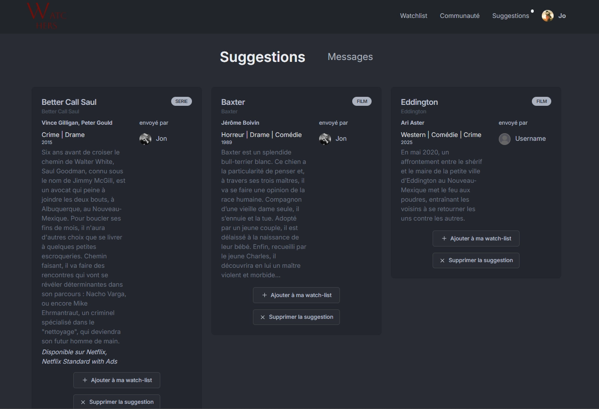
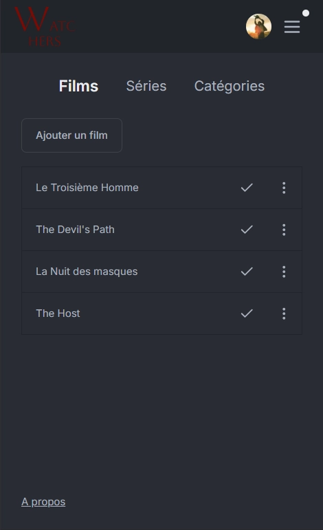

# 🎬 Watchers

**Une application collaborative de gestion de to-watch-list pour films et séries**

Watchers permet de créer et organiser ses listes de films et séries à regarder, tout en partageant des suggestions personnalisées avec ses contacts. L'application s'appuie sur l'API TMDB pour une recherche rapide et des informations à jour.

🔗 **[Voir la démo live](https://watchers-list.vercel.app/)**

---

## 📸 Aperçu

> **Note**: L'interface est actuellement en développement actif. Un design system cohérent est en cours d'intégration pour améliorer l'expérience utilisateur.

## 📸 Aperçu

### Dashboard principal


### Partage de suggestions



### Version mobile



---

## ✨ Fonctionnalités principales

- **🔐 Authentification sécurisée** avec Better Auth (gestion des sessions)
- **📝 Gestion de listes personnelles** : création et suivi de contenu à regarder
- **👥 Réseau de contacts** : ajout et gestion de connexions
- **💡 Partage de suggestions** : recommandations personnalisées entre utilisateurs
- **🔍 Recherche rapide** : intégration de l'API TMDB pour accéder à une base de données complète de films et séries

---

## 🛠️ Stack technique

### Core

- **Framework**: [Next.js 14](https://nextjs.org/) (App Router, Server Components)
- **Base de données**: PostgreSQL hébergé sur [Neon](https://neon.tech/)
- **ORM**: [Prisma](https://www.prisma.io/) pour les interactions avec la base de données

### Librairies principales

- **Styling**: Tailwind CSS
- **Authentification**: Better Auth
- **Validation**: Zod (schémas de validation type-safe)
- **State management**: Zustand
- **API externe**: TMDB API

### Tests & Qualité

- **Tests E2E**: Playwright
- **Tests unitaires**: Vitest
- **CI/CD**: Intégration continue avec tests automatisés

### Infrastructure

- **Déploiement**: Vercel
- **Stockage d'images**: Supabase (migration prévue vers une autre solution)

---

## 🎯 Défis techniques relevés

- **Gestion d'état hybride** : combinaison de Zustand pour l'état client et Server Actions pour les mutations côté serveur
- **Authentification robuste** : implémentation de Better Auth avec gestion sécurisée des sessions
- **Validation de données** : schémas Zod partagés entre frontend et backend pour garantir la cohérence
- **Tests automatisés** : mise en place d'une suite de tests E2E et unitaires intégrée au pipeline CI

---

## 🚀 Installation et développement local

### Prérequis

- Node.js 18+
- npm/yarn/pnpm/bun
- Un compte [TMDB](https://www.themoviedb.org/) pour obtenir un token API
- Une base de données PostgreSQL (Neon recommandé pour le développement)

### Variables d'environnement

Créer un fichier `.env.local` à la racine du projet :

```bash
# Database
DATABASE_URL="postgresql://..."

# Authentication
BETTER_AUTH_SECRET="your-secret-key"
BETTER_AUTH_URL="http://localhost:3000"

# Supabase (stockage d'images)
SUPABASE_SERVICE_ROLE_KEY="your-service-role-key"
NEXT_PUBLIC_SUPABASE_URL="your-supabase-url"
NEXT_PUBLIC_SUPABASE_ANON_KEY="your-anon-key"

# TMDB API
TMDB_READ_TOKEN="your-tmdb-token"
```

### Lancer le projet

```bash
# Installation des dépendances
npm install

# Générer le client Prisma
npx prisma generate

# Appliquer les migrations
npx prisma migrate dev

# Lancer le serveur de développement
npm run dev
```

L'application sera accessible sur [http://localhost:3000](http://localhost:3000)

### Tests

> **Note**: Les tests nécessitent un fichier `.env.test` avec une base de données dédiée pour éviter de polluer les données de développement. Dupliquez `.env.local` en `.env.test` et modifiez le `DATABASE_URL` vers une base de test.

```bash
# Tests unitaires
npm run test:unit

# Tests E2E
npm run test:e2e
```

---

## 🗺️ Roadmap

- [ ] Refonte du design system pour une interface cohérente
- [ ] Migration du stockage d'images vers une solution plus adaptée
- [ ] Ajout de notifications en temps réel

---
